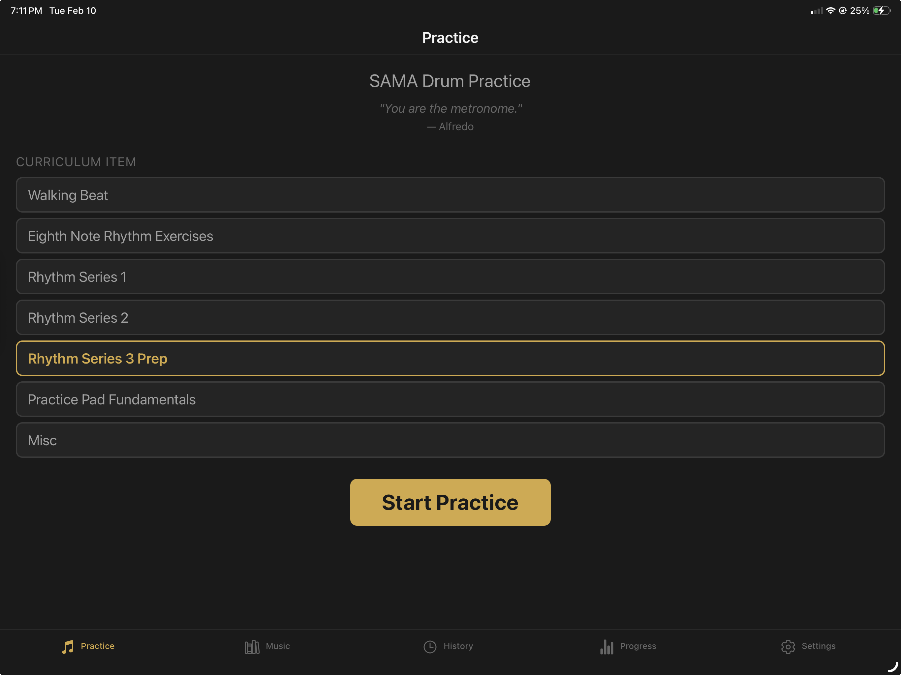

# SAMA Drum Practice

An iPad-first drum practice logging app for students following the San Antonio Music Academy drum curriculum. Replaces handwritten practice notes with real-time session logging, sheet music viewing, progress analytics, and cloud sync.

Built with ADHD-friendly principles: minimal friction, clear visual state, large touch targets.



## Features

- **Practice Logger** — Select a curriculum item, start a session, and log attempts per ostinato with tempo, mistake count, and break tracking
- **Sheet Music** — Browse and view sheet music for each curriculum exercise with built-in metronome
- **Session History** — Review past sessions with per-segment and per-ostinato breakdowns, notes, and video links
- **Progress Dashboard** — Mastery grid, tempo charts, streak tracking, and practice calendar heatmap
- **Settings** — Metronome sound picker, default tempo, haptics toggle, CSV export, and cloud sync controls
- **Cloud Sync** — Supabase-backed sync with Apple Sign-In authentication

## Tech Stack

- **Expo 54** / React Native 0.81 / TypeScript 5.9 (strict)
- **expo-sqlite** for local-first persistence
- **Zustand** for session state management
- **Supabase** for authentication and cloud sync
- **Victory Native** + Skia for progress charts

## Getting Started

```bash
npm install
npm start          # Start Expo dev server
npm run ios        # Run on iOS simulator
```

## Project Structure

```
app/(tabs)/        — Tab screens (Practice, Music, History, Progress, Settings)
app/session/       — Session detail route
app/sheet-music/   — Sheet music viewer route
components/        — Reusable UI components by domain
constants/         — Curriculum, theme, metronome sounds, sheet music config
db/                — SQLite schema, queries, seed data
stores/            — Zustand session store
services/          — Sync, metronome, and auth services
utils/             — Haptics, CSV export
```

## Curriculum Model

Linear progression: Walking Beat > Eighth Note Exercises > Rhythm Series 1-10. Each exercise is played over ostinato patterns (up to 8: 1A-4A, 1B-4B) for 32 measures each.

**Passing**: <=3 mistakes and ostinato didn't break. **Mastered**: Last 10 attempts average <=1 mistake with no breaks.
